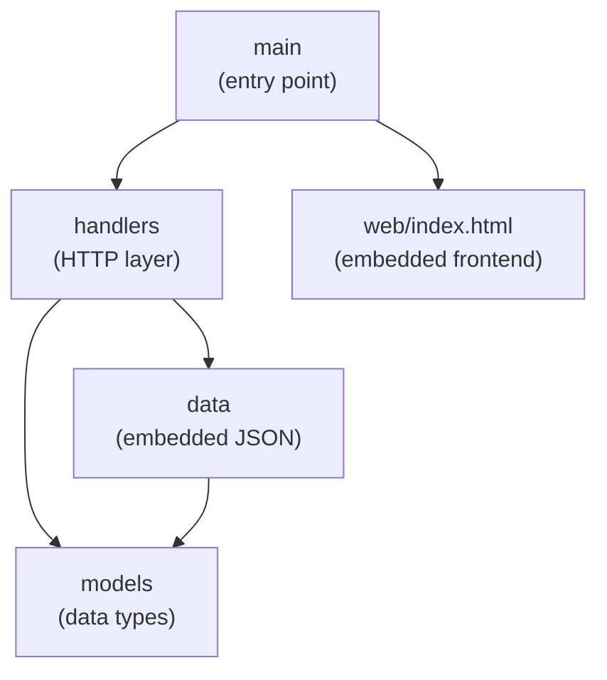
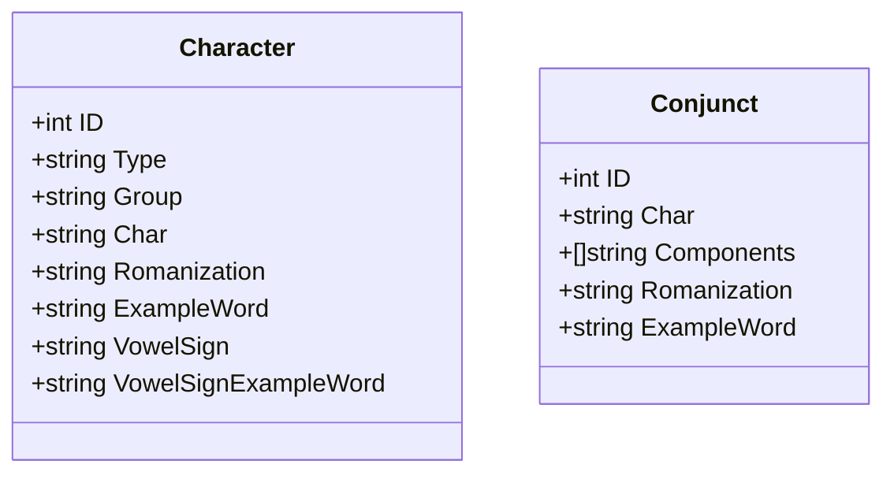
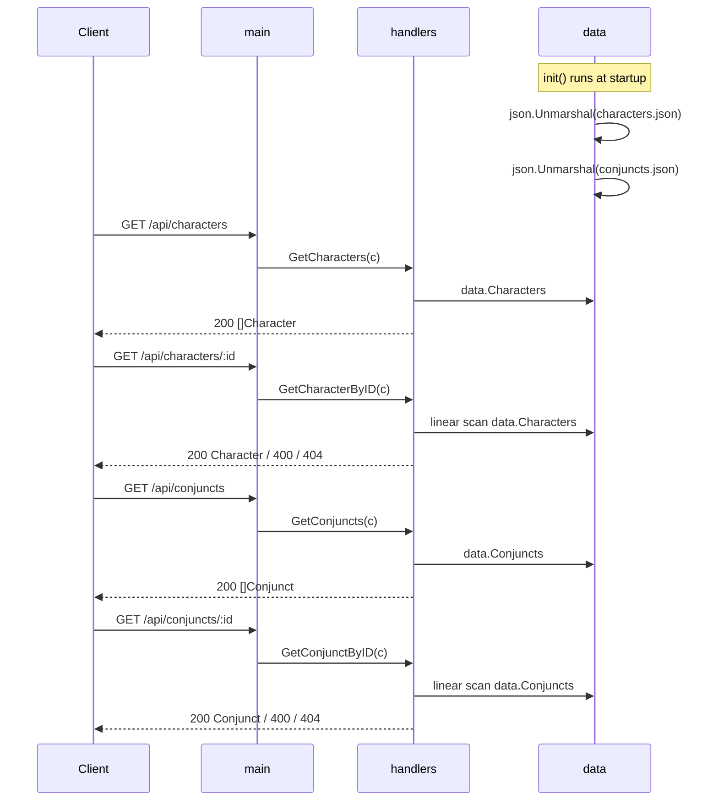

# Design

## Package Structure



---

## Data Models



`Character.Type` is `"vowel"` or `"consonant"`.

`Character.Group` is one of: `vowel`, `velar`, `palatal`, `retroflex`, `dental`, `labial`, `other`.

`Conjunct.Components` has 2 or 3 elements, each a single Bengali consonant. Sorted by first component following Bengali alphabet order.

`VowelSign` and `VowelSignExampleWord` are omitted (`omitempty`) for consonants and for the vowel অ (which has no separate diacritic form).

---

## Request Flow



---

## File Layout

```
backend/
├── main.go                  # server entry point, route registration
├── web/
│   └── index.html           # embedded test frontend
├── models/
│   ├── character.go         # Character struct
│   └── conjunct.go          # Conjunct struct
├── data/
│   ├── data.go              # embeds characters.json → data.Characters
│   ├── conjuncts_data.go    # embeds conjuncts.json  → data.Conjuncts
│   ├── characters.json      # 50 characters (vowels + consonants)
│   └── conjuncts.json       # 170 conjuncts sorted by first component
└── handlers/
    ├── characters.go        # GetCharacters, GetCharacterByID
    └── conjuncts.go         # GetConjuncts, GetConjunctByID
```
